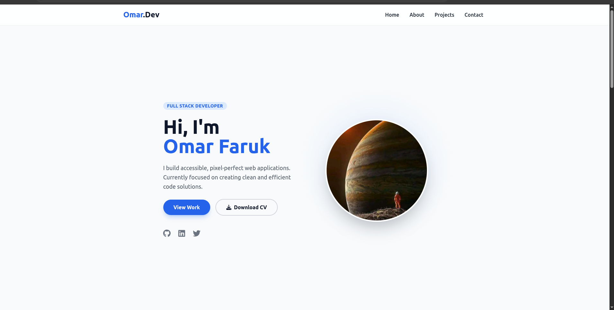
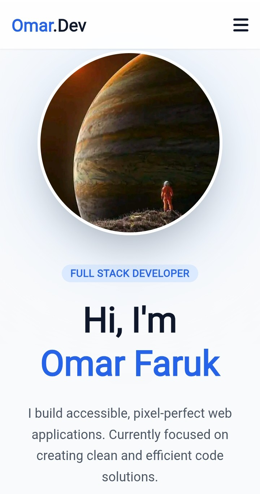

# 👨‍💻 Personal Portfolio Website


A fully responsive personal portfolio designed to showcase my skills, projects, and professional journey. Built with a **mobile-first approach** using HTML5 and Tailwind CSS.

## 🚀 Live Demo
### [👉 Click here to view the Live Site](https://omarfarukshaon.github.io/portfolio/)

---

## 📸 Project Previews

| **Desktop View** | **Mobile View** |
|:---:|:---:|
|  |  |

---

## ✨ Key Features

* **⚡ Fully Responsive:** Optimized for all screen sizes (Mobile, Tablet, Desktop).
* **🎨 Modern Design:** Clean UI built with **Tailwind CSS**.
* **📂 Project Showcase:** specialized grid layout to display GitHub projects.
* **📝 Contact Section:** Functional-looking contact form UI.
* **📱 Mobile Menu:** Interactive hamburger menu for smaller screens.
* **📄 Downloadable CV:** Direct link to download my resume.

## 🛠️ Tech Stack

* **Frontend:** HTML5, CSS3
* **Styling:** Tailwind CSS (via CDN)
* **Interactivity:** Vanilla JavaScript (Mobile Navbar)
* **Icons:** FontAwesome 6

## 📦 How to Run Locally

If you want to view this project on your local machine:

1.  **Clone the repository:**
    ```bash
    git clone [https://github.com/Omarfarukshaon/portfolio.git](https://github.com/Omarfarukshaon/portfolio.git)
    ```
2.  **Navigate to the folder:**
    ```bash
    cd portfolio
    ```
3.  **Open `index.html`** in your browser.

---

### 📬 Contact
**Omar Faruk** Full Stack Developer  
[GitHub](https://github.com/Omarfarukshaon)